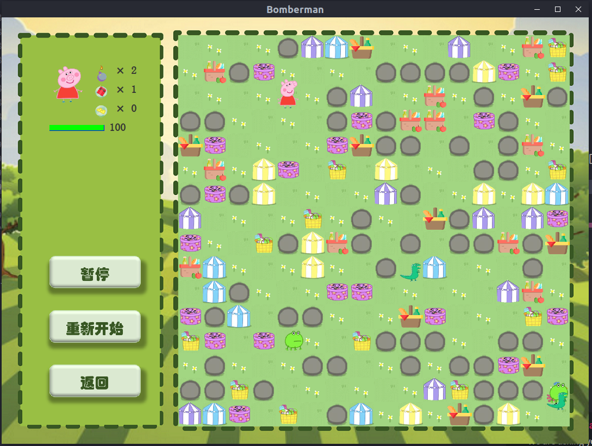

# Q版泡泡堂

> 本文档暂用于任务分工、类的解释、代码规范...非最终README文档

十分欢迎大家在push新代码的时候，能够同时修改此README文档，方便任务交接。

## 目录

- [项目架构](#项目架构)
- [任务分工](#任务分工)
- [代码规范](#代码规范)

## 项目架构

- [game](#game)
	- [Game](#Game)
	- [GameConstants](#GameConstants)
	- [StartGame](#StartGame)
	- [TimerListener](#TimerListener)
- [map](#map)
	- [Map](#Map-1)
	- [Cell](#Cell)
	- [MapMatrix](#MapMatrix)
- [player](#player)
	- [Player](#Player-1)
- [monster](#monster)
	- [Monster](#Monster-1)
- [bomb](#bomb)
	- [Bomb](#Bomb-1)
- [items](#items)
	- [Item](#Item)
	- [VelocityUp](#VelocityUp)
- [ui](#ui)
	- [MainFrame](#MainFrame)
	- [MenuPanel](#MenuPanel)
	- [MapPanel](#MapPanel)
	- [StatusPanel](#StatusPanel)
	- [ThumbnailPanel](#ThumbnailPanel)
	- [EditorPanel](#EditorPanel)

> 目前只是对各个类实现功能的初步描述，欢迎大家在上传代码后或码代码的同时，完善各个类的功能介绍。这样大家在调用别的类的方法时，能够得到清晰的描述，更加方便。
---
## 游戏效果图

---
### game
11.18更新-已经不再是负责前端的包，前端相关已统一移到[ui](#ui)包中。  

> 这样做的原因在于之前想要独立StatusPanel时，发现必须要MapPanel(原Display)的引用。创建一个前端页面需要另一个前端就很奇怪，MapPanel实际上承担了不应属于它的职责，因此做了进一步分离。

负责储存整个游戏信息的[包](src/game)。  

#### Game
储存游戏进程的[类](src/game/Game.java)。   
储存整个游戏进程，主要负责游戏的初始化，提供set(),get()方法供前端使用。

#### GameConstants
储存游戏常数的[接口](src/game/GameConstants.java)。   
作为接口，储存游戏所需常数。

#### StartGame
游戏入口的[类](src/game/StartGame.java)。   
整个游戏的入口，只包含main方法。

#### TimerListener
负责刷新游戏状态的[类](src/game/TimerListener.java)。   
将每30毫秒的刷新方法从原Display类中独立出来。目前负责刷新游戏状态、重画MapPanel和StatusPanel。

---
### map
负责处理地图逻辑的[包](src/map)。  
包含有地图，以及构成地图的格点(Cell）。

#### Map
负责整张地图的[类](src/map/Map.java)。  
储存整个地图的信息，地图可认为由Cell构成。此类主要只处理和地图有关的逻辑，即人物移动、炸弹爆炸等方法均应该在其它类中实现，逻辑上**不适合**出现在此类中。可通过调用地图中各方法获得每个地图格点上的信息，鉴于存在数组越界风险且多层调用增加繁琐步骤，**不再建议**通过地图类中的map函数获得格点对象获取相应信息。

#### Cell
负责地图每个格点的[类](src/map/Cell.java)。    
每个Cell中可以有可破坏障碍物，不可破坏障碍物，炸弹，道具，是否处于爆炸范围等等信息。其它类的方法应通过调用地图类中的方法访问格点上的信息。

#### MapMatrix
负责辅助地图生成的[类](src/map/MapMatrix.java)。  
MapMatrix中包含可以随机生成含障碍物的地图或载入已有矩阵的方法。地图创建初始化后使用MapMatrix布置障碍物，或直接使用MapMatrix初始化。目前尚未实现具体功能。

---
### player
负责玩家的[包](src/player)。  
暂时只包含一个类，之后可以拓展为不同的角色。在人机对战时，电脑人也类似于玩家的操作逻辑。

#### Player
负责玩家的[类](src/player/Player.java)。  
应包含有玩家的速度、炸弹个数、炸弹威力、存货状态、坐标等等成员变量。移动、放置炸弹等成员方法。根据初步讨论，玩家在移动到一整格之前，不应接收其它指令，可以在移动方法中加入是否整除的判断。  
此类还应该实现键盘监听，键盘负责改变玩家的direction，要使玩家松开按键时停止，可以考虑加上STOP这一direction。

10.22更新-目前简单完善了Player类的功能，实现了坐标、方向、速度等参数的set()和get()方法以及按键控制。

11.1更新-将人物和地图链接，人物可以初步实现在两格中间连续移动并停在格点上的效果

11.9更新-增加了人物血条，游戏中实时显示，当人物碰到怪物时生命值会下降

11.11更新-基本解决了人物移动时按键延迟的问题；实现了人物放置炸弹的方法（按空格键放炸弹），目前只是简单地在地图的格点上画一张炸弹的图片，暂未使用bomb类

11.12更新-实现了双人模式，玩家1用方向键和回车控制，玩家2用w,a,s,d和空格键控制。如果调试时需要单人模式，可以把display里的playerNum变量改成1.

11.15更新-增加了一个简单的状态栏，玩家会被炸弹伤害；伤害不是连续的，两次伤害间有1s左右的时间间隔

---
### monster
负责怪物的[包](src/monster)。  
暂时只包含一个类，之后可以拓展为不同的怪物类型。

#### Monster
负责怪物的[类](src/monster/Monster.java)。  
随机移动（与玩家的移动方法基本相似，互相沟通），警戒范围，脱离警戒范围，被炸弹消灭。

11.12更新-全地图随机游走。玩家进入警戒范围（`ALERT_DISTANCE`）后，开始跟随玩家，直到被消灭或脱离警戒范围。与玩家碰撞后扣除玩家一定血量（`HP_LOSS_BY_MONSTER`）

---
### bomb
负责炸弹的[包](src/bomb)。  
可能只有一种炸弹？为了结构考虑还是当做一个包来处理。

#### Bomb
负责炸弹的[类](src/bomb/Bomb.java)。  
需要与地图、人物、怪物等所有类交互，逻辑比较复杂。主要难点在爆炸范围的计算上。

---
### items
负责道具的[包](src/items)。  
里面有Item作为所有道具的父类，以及若干道具。

#### Item
负责所有道具的[类](src/items/Item.java)。  
应该实行被拾取后从地图上消失的功能，具体到每个道具的功能则在子类中实现。

#### VelocityUp
负责增加移速道具的[类](src/items/VelocityUp.java)。  
一个示例，即被拾取了以后调用Player对象的setVelocity()方法来改变速度，消除自身，通过继承父类方法实现。

---
### ui
负责前端展示的[包](src/ui)。  
所有前端界面在此绘制。

#### MainFrame
负责主窗口的[类](src/ui/MainFrame.java)。  
只负责提供一个窗口JFrame。上面的所有Panel均在其他类中实现。

#### MapPanel
负责绘制地图界面的[类](src/ui/MapPanel.java)。原名Display  
将Player, Monster等类的对象作为成员变量统一在此，进而能够通过各个类提供的方法，获取这些成员变量的坐标值，最后通过JPanel提供的方法将图像绘制在视窗中。具体使用方法是通过每30毫秒执行一次的actionPerformed()方法重新绘制界面。

10.22更新-将Display类和Player类结合，能够实现人物在空白窗口的移动。

11.1更新-加入了怪物类的图片加载，移动，刷新功能。

11.18更新-更名为MapPanel，Display中的前端部分独立放置于此。不再有player等成员变量，只保留game一个成员变量，再通过game调用人物怪物的位置。

#### MenuPanel
负责绘制主菜单的[类](src/ui/MenuPanel.java)。    
逻辑相对比较简单，即通过不同按钮链接到不同页面中，需要等待其它类实现完成后，最后实现。

11.18更新-基本完成。

#### StatusPanel
负责绘制状态栏的[类](src/ui/StatusPanel.java)。    
提供人物血量，暂停，返回，重开功能。

#### ThumbnailPanel
用于在选择关卡时绘制缩略图，缩略图中仅包括地面和障碍物，不包括玩家，怪物，道具等组件．缩略图的大小由`SCALE_FACTOR`定义．

#### EditorPanel
关卡编辑器的可视化界面，用于在此界面内创建及修改玩家自定义关卡的地图、人物和怪物生成位置等信息

---
## 任务分工
> 大家每次向github提交代码的时候，欢迎修改此项以描述自己所做的工作

- 陈卓凡：组长，后端，负责[map](#map)包，关卡编辑器界面
- 郑俊悦：后端，负责[items](#items)包
- 陶然：前端，负责[game](#game)包
- 杨韫加：后端，负责[bomb](#bomb)包
- 詹昊哲：后端，负责[items](#items)包
- 熊诚凇：后端，负责[player](#player)包，主菜单、状态栏的绘制
- 陈航：后端，负责[monster](#monster)包
- 李柏瑶：前端，负责[game](#game)包
- 王汤军：后端，负责接口交接

## 代码规范
- 所有代码（除UI界面）使用英文，主要指注释部分。
- 每个类请务必加上说明注释，简单描述该类实现的功能。若可以的话，欢迎为每个方法也加上说明注释。具体使用方法可参考[此页面](https://www.runoob.com/java/java-documentation.html)。
- 变量命名请使用驼峰命名法，即每个单词首字母大写，其余均小写。包名首字母小写，类名首字母大写。
- github相关的使用教程，请参考慕课4.9节教程。Eclipse等IDE可以利用内置的git插件，可参考[此页面](https://blog.csdn.net/bendanany/article/details/78891804)。
- 类的成员变量均为private，类的成员方法均为public。每个成员变量均需要设置set()和get()方法，即便不一定使用。
- 地图坐标，左上角为(0,0)，x轴向右，y轴向下。
- 上传github时，请不要上传配置文件如.classpath或.project，可以通过配置.gitignore来解决
- 请尽可能不要使用意义不明的数字来表示方向或其它常数。常数一并放入game包中的GameConstants接口。目前规定的常数有五个方向，上=0，右=1，下=2，左=3，停=-1
- 地图16×16格，每格60×60
- 目前想法，每个类设置一个refresh()函数，把上一帧和下一帧的**所有**区别都放在这个方法中。
